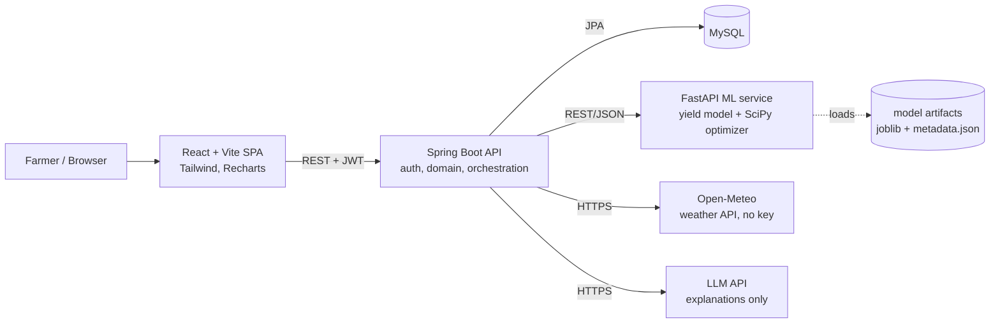
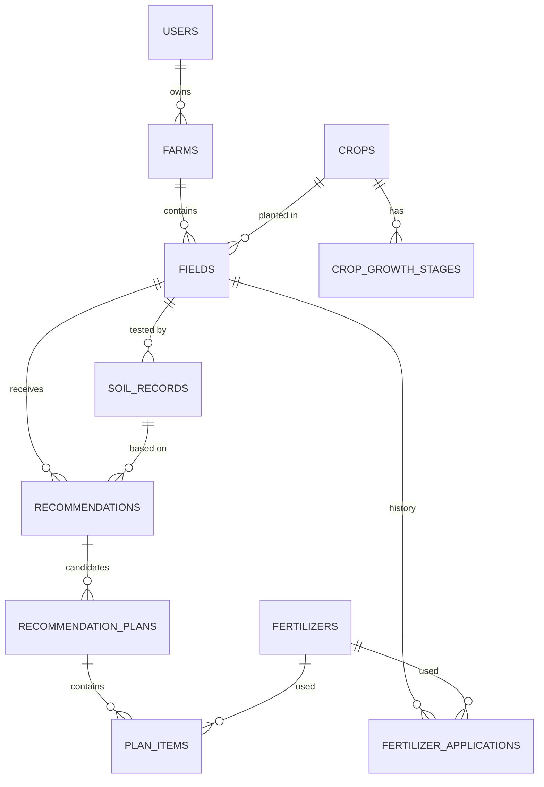

# AgriOptima — System Architecture

> AI-Powered Sustainable Fertilizer Optimization
> Hackathon decision-support prototype. Not a replacement for professional agronomic advice.

This document is the Milestone 1 deliverable. It fixes the architecture that all later milestones build on.
Anything marked **[ASSUMPTION]** is a design assumption that is documented rather than proven.

---

## 1. Final system architecture

Four runtime components, one database, two external services.



| Component | Owns | Does NOT own |
|---|---|---|
| **Frontend** (React) | UI, charts, forms, client routing, JWT storage | Any calculation that affects a recommendation |
| **Backend** (Spring Boot) | Auth, users, farms/fields/soil/crops/fertilizers CRUD, the **deterministic nutrient-requirement engine**, orchestration of a recommendation run, plan scoring and selection, schedule, weather rules, sustainability metrics, LLM prompt assembly, persistence | Model training/inference, numerical optimization |
| **ML service** (FastAPI) | Model loading, preprocessing, yield prediction, model versioning, **SciPy LP optimizer** that produces candidate plans | Users, persistence, business workflow |
| **MySQL** | System of record | — |
| **Open-Meteo** | Current conditions + 7-day forecast | — |
| **LLM** | Natural-language "Why this recommendation?" from structured results | Quantities, data, model results, selection |

Why the optimizer sits in Python: the stack mandates SciPy, and co-locating it with the yield model keeps
all numerical code in one testable service. Spring stays the orchestrator and the source of truth for
constraints (it sends the requirement; the optimizer must satisfy it; Spring re-verifies the result).

## 2. Component architecture

### Backend (Spring Boot, layered)

```
controller/   thin REST controllers, DTO in/out, @Valid
service/      business logic
  auth/         registration, login, JWT issue/verify
  domain/       Farm, Field, Soil, Crop, Fertilizer, Application services
  engine/       NutrientRequirementEngine  (deterministic, pure Java, unit-tested)
                PlanScoringService         (ranks candidate plans)
                ScheduleService            (splits a plan across growth stages)
                SustainabilityService      (transparent metrics)
                WeatherAdvisoryService     (rain-before-application warnings)
  integration/  MlServiceClient, WeatherClient, LlmClient (each with timeouts + fallback)
  recommendation/ RecommendationOrchestrator (the end-to-end pipeline below)
repository/   Spring Data JPA
entity/       JPA entities
dto/          request/response records
config/       security, CORS, OpenAPI, HTTP clients
exception/    GlobalExceptionHandler -> RFC 7807 problem details
```

### ML service (FastAPI)

```
app/main.py            routes: /health, /model/info, /predict-yield, /optimize
app/schemas.py         pydantic request/response models (validation)
app/model_store.py     loads artifact + metadata once, exposes version
app/preprocess.py      shared feature pipeline (same code used in training)
app/optimizer.py       SciPy linprog formulation + candidate strategies
training/              data prep, training, evaluation, model selection scripts
artifacts/             model.joblib, metadata.json, evaluation report
```

> **Milestone 6 outcome (as built):** layered as routes → schemas → services → model_store / optimizer.
> `app/api/routes.py` (thin routes), `app/api/schemas.py` (HTTP contracts with units), `app/services.py` (use cases:
> model state, supported-crop check, response metadata; no model or LP maths), `app/errors.py` (RFC 7807, same shape
> as the backend), `app/config.py` (`MODEL_ARTIFACT_DIR`, `ML_CORS_ALLOWED_ORIGINS`), `app/main.py` (`create_app`,
> model loaded once in the lifespan). The shared feature pipeline is `app/features.py` (not `preprocess.py`). If the
> artifact is missing or broken, the service starts DEGRADED: `/predict-yield` and `/model/info` return 503, and
> `/optimize` still works. Contract: [ML_API.md](ML_API.md).

### Frontend (React)

```
src/api/         axios instance (JWT interceptor, 401 -> logout), typed endpoint wrappers
src/context/     AuthContext, ActiveFieldContext (selected farm/field shared across pages)
src/layouts/     AppShell (sidebar + topbar), AuthLayout
src/pages/       one folder per page (see §4)
src/components/  cards, charts, tables, form controls, toasts, empty/error/loading states
```

## 3. Data flow — one recommendation run

```mermaid
sequenceDiagram
    participant FE as React
    participant BE as Spring Boot
    participant WX as Open-Meteo
    participant ML as FastAPI
    participant L as LLM
    FE->>BE: POST /api/fields/{id}/recommendations
    BE->>BE: load field, crop, stage, latest soil test, season's prior applications
    BE->>WX: forecast(lat, lon)
    BE->>BE: NutrientRequirementEngine -> required N, P2O5, K2O (kg/ha) + reasons
    BE->>ML: POST /optimize {requirement, fertilizers, prices, strategies}
    ML-->>BE: candidate plans A, B, C (each satisfies requirement)
    BE->>BE: re-verify hard constraints; drop any plan that fails
    BE->>ML: POST /predict-yield (batch: one row per plan + current practice)
    ML-->>BE: predicted yield per plan + model version
    BE->>BE: sustainability metrics, composite score, select plan, build schedule, weather warnings
    BE->>DB: persist recommendation + plans + items
    BE-->>FE: recommendation (explanation pending)
    FE->>BE: POST /api/recommendations/{id}/explanation
    BE->>L: structured facts only (JSON)
    L-->>BE: narrative
    BE-->>FE: explanation (template fallback if LLM unavailable)
```

The explanation is a separate call so the core recommendation never waits on, or fails because of, the LLM.

## 4. Module breakdown

| # | Module | Backend | Frontend page |
|---|---|---|---|
| 1 | Authentication | register, login, JWT, BCrypt | Login / Register |
| 2 | Dashboard | aggregate endpoint | Dashboard |
| 3 | Farm management | Farm CRUD | Farms |
| 4 | Field management | Field CRUD (area, irrigation, location) | Fields |
| 5 | Soil management | SoilRecord CRUD + history + fertility rating | Soil Analysis |
| 6 | Crop management | Crop catalogue, growth stages; field crop/stage/season | Crop |
| 7 | Fertilizer management | Fertilizer catalogue (N/P2O5/K2O %, price, source) | Settings → Fertilizers |
| 8 | Application history | FertilizerApplication CRUD (previous usage) | Field detail / History |
| 9 | Recommendation | orchestrator + engine + scoring | Fertilizer Recommendation |
| 10 | Schedule | stage-wise split of selected plan | Application Schedule |
| 11 | Weather | Open-Meteo proxy + advisory rules | Weather |
| 12 | Yield prediction | ML proxy | Yield Prediction |
| 13 | What-if simulator | evaluate arbitrary plans (no persistence required) | What-if Simulator |
| 14 | Sustainability | metrics + formula endpoint | Sustainability |
| 15 | AI assistant | LLM explanation with grounding + fallback | panel on Recommendation page |
| 16 | History | past recommendations | History |

## 5. Domain / database model (initial)

All tables have `id BIGINT PK AUTO_INCREMENT`, `created_at`, `updated_at` (JPA auditing).
Nutrient units everywhere: **kg/ha of N, P2O5, K2O** (the convention fertilizer grades use).
Soil test values: **kg/ha available N, P, K** as reported by typical soil-test labs. [ASSUMPTION: the P/K
unit convention is fixed and documented in the knowledge base in Milestone 4.]



| Table | Key columns | Constraints / indexes |
|---|---|---|
| `users` | full_name, email, password_hash, role | UNIQUE(email) |
| `farms` | user_id, name, location_name, latitude, longitude | FK users; IDX(user_id) |
| `fields` | farm_id, name, area_ha, irrigation_type, soil_type, crop_id, growth_stage_id, season, sowing_date, previous_crop | FK farms, crops, crop_growth_stages; CHECK area_ha > 0 |
| `crops` | code, name, description (+ base_n, base_p2o5, base_k2o, source_ref added in M4) | UNIQUE(code) |
| `crop_growth_stages` | crop_id, code, name, seq, description (+ timing / N-P-K split columns added in M4) | UNIQUE(crop_id, code), UNIQUE(crop_id, seq) |
| `soil_records` | field_id, sample_date, nitrogen, phosphorus, potassium, ph, organic_carbon, moisture | FK fields; IDX(field_id, sample_date) |
| `fertilizers` | code, name, n_pct, p2o5_pct, k2o_pct, price_per_kg, bag_kg, source_ref, active | UNIQUE(code); CHECK pct 0..100 |
| `fertilizer_applications` | field_id, fertilizer_id, applied_on, quantity_kg, stage_code | FK; IDX(field_id, applied_on) |
| `recommendations` | field_id, soil_record_id, crop_id, stage_code, required_n/p2o5/k2o, weather_summary, warnings(json), explanation, explanation_source, status | FK; IDX(field_id, created_at) |
| `recommendation_plans` | recommendation_id, label, strategy, total_cost, supplied_n/p2o5/k2o, excess_n/p2o5/k2o, predicted_yield_t_ha, model_version, sustainability_score, composite_score, selected, is_baseline | FK; IDX(recommendation_id) |
| `plan_items` | plan_id, fertilizer_id, kg_per_ha, total_kg, cost, stage_code | FK |

Consolidation decisions vs. the brief's entity list:
- **As built in M7 (Flyway V3):** `recommendations` keeps status, feasible, crop/stage codes, area, required N/P2O5/K2O,
  selected strategy, scoring mode, KB and model versions, plus the **full response JSON** (`response_json`), with
  warnings and assumptions inside the JSON. `recommendation_plans` keeps strategy, cost, field cost, excess, mass,
  predicted yield, score and selected. Soil record, weather, explanation, sustainability and baseline columns are
  deferred until those features exist.
- `OptimizationRun` + `YieldPrediction` are folded into `recommendation_plans` (one row = one candidate
  plan with its optimizer output and its predicted yield + model version). A separate table added joins
  without adding information.
- `CropRequirement` is folded into `crops` (base dose) + `crop_growth_stages` (split per stage).
- `WeatherRecord` is **not** persisted as a table in v1; the weather summary used for a decision is stored
  on the recommendation for auditability. Live weather is fetched and cached in memory (10 min).

## 6. ML architecture

**Problem:** crop yield regression (t/ha).

**Candidate features** (final set chosen in Milestone 3 after leakage checks): crop, season, soil N/P/K,
pH, rainfall, temperature, humidity, irrigation, applied N/P2O5/K2O.

> **Milestone 3 outcome:** trained on the real CIMMYT CSISA LDS 2018 wheat + rice surveys (no synthetic data).
> Final features: applied N / P2O5 / K2O kg/ha, Zn applied, sowing day, irrigation available, FYM applied,
> crop, state, soil texture, variety type, previous crop. Soil-test N/P/K/pH and weather are not in any usable
> dataset with applied fertilizer, so they are **not** yield-model inputs. They act through the requirement
> engine (M4) and weather rules (M10). See [DATA_CARD.md](DATA_CARD.md) and [MODEL_CARD.md](MODEL_CARD.md).

Applied-fertilizer features are essential: without them the model cannot distinguish plans, and the
"ML + optimization" loop is meaningless. The dataset choice is driven by this requirement.

**Data strategy (decided in Milestone 3, recorded in PROJECT_STATUS.md):**
field-level public datasets that contain soil tests *and* applied fertilizer *and* yield are rare.
The plan is:
1. Search for a usable public dataset with yield + fertilizer inputs (Kaggle / open research data).
2. If none is adequate, build a **synthetic dataset** whose response to fertilizer follows a documented
   agronomic response-curve form, with noise, calibrated to published yield ranges — and label it
   **"Synthetic / simulated data for prototype purposes."** everywhere it appears.
Either way, reported metrics are exactly what the evaluation script prints.

**Pipeline:** raw → cleaning → missing values → unit normalisation → justified outlier handling →
feature engineering → train/test split → training (Linear Regression, Decision Tree, Random Forest,
XGBoost) → k-fold CV + held-out test (MAE, RMSE, R²) → selection by validation score → persist
`model.joblib` (full sklearn `Pipeline`, so preprocessing is bundled) + `metadata.json` (version, features,
metrics, data source, training date).

**Serving:** FastAPI loads the artifact at startup; `/predict-yield` accepts a batch; inputs outside the
training range are clipped and flagged `extrapolation: true` in the response.

## 7. Optimization architecture

Decision variables: `x_i ≥ 0` = kg/ha of fertilizer *i* (Urea, DAP, MOP, NPK 10:26:26, SSP, …).
`a_ij` = fraction of nutrient *j* ∈ {N, P2O5, K2O} in fertilizer *i*; `r_j` = required kg/ha; `e_j ≥ 0` = excess.

```
minimize    Σ_i c_i·x_i                  (cost, ₹/ha)
          + λ_e · Σ_j e_j                (excess-nutrient penalty)
          + λ_s · Σ_i x_i                (sustainability penalty: total product mass applied)
subject to  Σ_i a_ij·x_i − e_j = r_j     for every nutrient j   (supply ≥ requirement)
            0 ≤ x_i ≤ x_i,max            (per-product cap, practical upper bound)
            e_j ≥ 0
```

This is a linear program, solved with `scipy.optimize.linprog` (HiGHS). It is exact, fast (<10 ms) and
explainable on a slide.

**Candidate plans** come from solving the same LP with different weight profiles:

| Plan | λ_e | λ_s | Intent |
|---|---|---|---|
| A — Lowest cost | small | 0 | cheapest plan that meets requirement |
| B — Minimal excess | large | small | tightest nutrient match |
| C — Balanced | medium | medium | default trade-off |

[ASSUMPTION] λ values are **tuning weights expressed in ₹ per kg**, not scientific constants. They are
documented as such and exposed on the Sustainability page.

> **Milestone 4 outcome:** the requirement `r_j` is produced by `NutrientRequirementEngine` (package
> `com.agrioptima.engine`, not `service/engine/` as sketched in §2) as `requirementForOptimizer.kgPerHa`: the
> nutrients due at the current stage after soil-test adjustment and previous applications. The knowledge base is
> `backend/src/main/resources/knowledge/nutrient-kb-v1.json` (not DB columns on `crops`/`crop_growth_stages` as
> planned in §5). See [RECOMMENDATION_ENGINE.md](RECOMMENDATION_ENGINE.md).

> **Milestone 5 outcome:** the LP above is implemented in `ml-service/app/optimizer.py` (`linprog`, HiGHS dual
> simplex), with the structure unchanged: x_i kg/ha, supply ≥ requirement, 0 ≤ x_i ≤ cap. Since e_j = s_j − r_j is
> linear in x, it needs no extra variables. The plan objectives differ from the λ table:
> A = min cost (tie-break: least excess), B = min total excess (tie-break: cost), and
> C = min excess subject to cost ≤ C_A + β·(C_B − C_A), with β = 0.5 as a prototype parameter.
> The weighted form was implemented first (λ_e = ₹20/kg, λ_s = ₹0.5/kg), and plan C came out identical to plan A on
> all five M4 examples. A weighted LP only jumps between vertices at an arbitrary λ threshold, whereas the budget form
> gives a real intermediate plan with a provable guarantee. Plans are rounded to 1 g/ha and re-verified with no
> tolerance before they are returned. The Java re-check is `com.agrioptima.engine.plan.FertilizerPlanVerifier`,
> which is pure and unit-tested and is wired into the orchestrator in M7. Details, assumptions and actual results:
> [OPTIMIZER.md](OPTIMIZER.md).

> **Milestone 7 outcome (as built):** `RecommendationService` (package `service.recommendation`) orchestrates the
> requirement (M4), then `MlServiceClient` → `/optimize`, then `FertilizerPlanVerifier`, then `/predict-yield` (one
> season-total scenario per plan), then `PlanScoringService`, then persistence. Plan C is the M5 budget form. The score
> is predicted yield × crop price − cost − ₹20/kg × excess, with no sustainability term yet. Without yields (maize,
> missing state/sowing date, model down) plans are ranked on cost and excess only. Infeasible requirements are
> stored and returned with `feasible:false`. ML failures return 502/503/504 problem details, and a failed yield
> prediction degrades gracefully. There is no weather, schedule or LLM step yet. Details:
> [RECOMMENDATION_FLOW.md](RECOMMENDATION_FLOW.md).

**Selection (Spring Boot, `PlanScoringService`):** all candidates already satisfy the hard constraint
(re-verified in Java). The ML model then predicts yield per plan and a transparent composite score picks
the final plan: expected revenue (predicted yield × crop price) − fertilizer cost − excess penalty. The ML
model can only choose *among* constraint-satisfying plans; it can never add, remove or resize a plan.

## 8. API architecture

Backend (`/api`, JSON, JWT bearer except auth; Swagger UI at `/swagger-ui.html`):

```
POST   /api/auth/register            POST /api/auth/login           GET /api/auth/me
GET|POST        /api/farms           GET|PUT|DELETE /api/farms/{id}
GET|POST        /api/farms/{id}/fields
GET|PUT|DELETE  /api/fields/{id}
GET|POST        /api/fields/{id}/soil-records      DELETE /api/soil-records/{id}
GET|POST        /api/fields/{id}/applications      DELETE /api/applications/{id}
GET             /api/crops           GET /api/crops/{id}/stages
GET|POST|PUT    /api/fertilizers
POST            /api/fields/{id}/recommendations   GET /api/fields/{id}/recommendations
GET             /api/recommendations/{id}
POST            /api/recommendations/{id}/explanation
GET             /api/recommendations/{id}/schedule
POST            /api/simulator/evaluate            (current vs user vs optimized, not persisted)
GET             /api/fields/{id}/weather
GET             /api/fields/{id}/sustainability
GET             /api/dashboard
GET             /api/ml/model-info
```

ML service (internal only, not exposed publicly):

```
GET  /health          GET  /model/info
POST /predict-yield   POST /optimize
```

ML service errors (Milestone 6): 400 malformed JSON, 422 validation / `unsupported-crop`, 503 model not loaded,
500 optimizer failure / internal. `/optimize` answers an unreachable requirement with **200** `status: INFEASIBLE`
(a valid result with per-nutrient reasons), not an error. Details: [ML_API.md](ML_API.md).

Errors: RFC 7807 `application/problem+json`; 400 validation, 401 unauthenticated, 403 not owner,
404 not found, 409 conflict (duplicate email), 502/503 when a downstream service fails (with fallback where
one exists).

## 9. Repository structure

```
agrioptima/ (repo root)
├── frontend/          React + Vite + Tailwind
├── backend/           Spring Boot (Maven wrapper, Java 21)
├── ml-service/        FastAPI app, training scripts, tests, artifacts
├── data/
│   ├── raw/           downloaded datasets (git-ignored if large; download script provided)
│   ├── processed/     cleaned training data
│   └── knowledge/     crops, stages, fertilizers (JSON, with sources)
├── docs/              architecture, data card, model card, demo script
├── scripts/           dev helpers (start-all, seed, download data)
├── docker/            Dockerfiles / nginx config
├── docker-compose.yml
├── .env.example
├── README.md
└── PROJECT_STATUS.md
```

## 10. Development plan

| M | Milestone | Exit criteria |
|---|---|---|
| 1 | Requirements + architecture | this doc, repo skeleton, toolchain verified |
| 2 | DB + backend foundation | Spring Boot boots, entities + migrations, auth with JWT, CRUD for farm/field/soil, Swagger, tests |
| 3 | Data + ML pipeline | dataset decision recorded, 4 models compared, metrics report generated, artifact saved |
| 4 | Recommendation engine | knowledge base with sources, requirement engine in Java, unit tests |
| 5 | Optimization engine | LP optimizer + 3 strategies, pytest |
| 6 | ML API | FastAPI `/predict-yield`, `/optimize`, `/model/info`, pytest |
| 7 | Spring Boot integration | orchestrator end-to-end, scoring, persistence, schedule |
| 8 | React dashboard | auth, layout, farm/field/soil/crop pages, recommendation page |
| 9 | What-if simulator | 3-way comparison with charts |
| 10 | Weather | Open-Meteo, weather page, rain advisory |
| 11 | AI explanation | grounded LLM prompt + template fallback |
| 12 | Testing + Docker | JUnit/Mockito/pytest suites green, compose up works |
| 13 | Polish + deploy | demo seed data, demo script, README, deployment |

### Local environment notes

- The machine has Java 8 system-wide; Spring Boot 3 needs 17+. A portable Temurin JDK 21 lives in the
  git-ignored `.tools/` folder and scripts point `JAVA_HOME` at it. No system changes.
- Docker and MySQL are not installed locally. The backend therefore ships two profiles:
  `mysql` (default for Docker Compose / deployment) and `dev` (embedded H2 in MySQL mode for zero-setup
  local runs). The same JPA entities and SQL migrations run on both.
